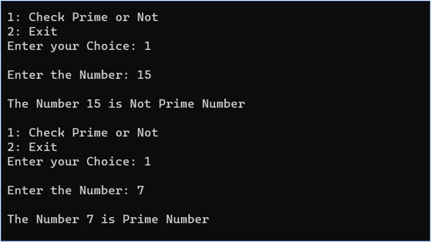
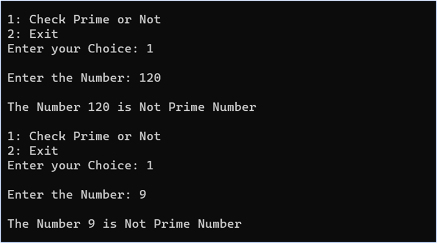
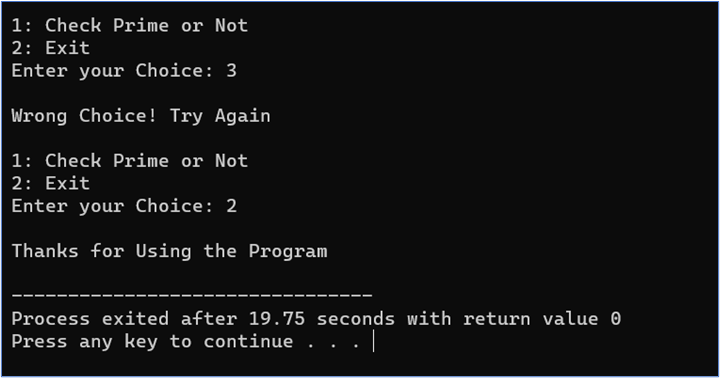

# Optimized Prime Checker

This C++ program efficiently checks whether a given integer is a prime number.

## Code Explanation
The code consists of two main parts:

The isprime function employs an optimized algorithm to determine whether a number is prime or not.

The main function takes user input, calls the isprime function, and promptly indicates whether the input number is prime or not.

Example:

Enter the Number: 17

The Number 17 is Prime

## Notes
Prime numbers are defined as positive integers greater than 1.

This code is designed for efficiency in checking small to moderately sized numbers. For very large numbers, advanced algorithms like the Sieve of Eratosthenes or probabilistic primality tests (e.g., Miller-Rabin) are recommended.

## 📸 Screenshots
Here are some captivating screenshots illustrating the functionality of the Optimized Prime Checker:

Output

**Optimized Prime Checker**

