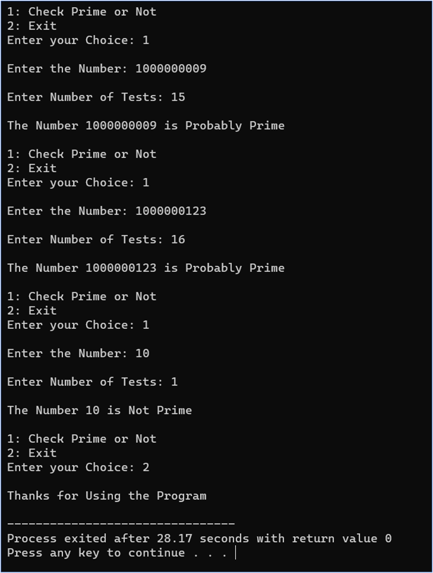

# Fermat's Little Theorem Prime Checker

This C++ program checks whether a given integer is likely to be a prime number using Fermat's Little Theorem for primality testing.

## Code Explanation
The code consists of two main functions:

1. The `mod_pow` function calculates modular exponentiation efficiently.
2. The `is_prime` function performs the Fermat's Little Theorem primality test.

**Example:**

Enter the Number: 17
Enter Number of Tests: 5

The Number 17 is Probably Prime

## Notes
- Prime numbers are defined as positive integers greater than 1.

- Fermat's Little Theorem states that if `p` is a prime number, then for any integer `a` not divisible by `p`, the equation `a^(p-1) ≡ 1 (mod p)` holds.

- This code uses multiple tests (specified by the user) to determine the likelihood of a number being prime.

## 📸 Screenshots
Here are some screenshots illustrating the functionality of the Fermat's Little Theorem Prime Checker:

- **Fermat's Little Theorem Prime Checker**

